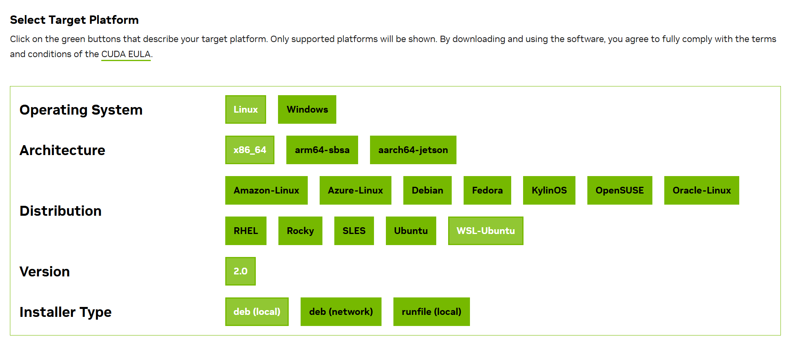
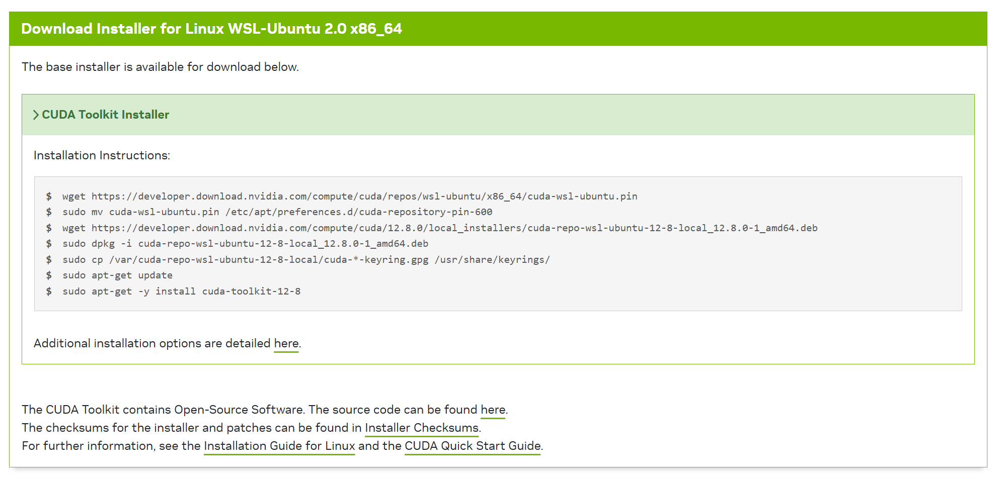

# CUDA Installation

**Select the Device Configuration**

**Follow the Instructions according to you device**


Follow these initial steps to install CUDA:

1. **Download CUDA Toolkit:**  
   Visit NVIDIA's website and download the appropriate CUDA version for your system.

2. **Install the CUDA Toolkit:**  
   Follow the installation instructions provided by NVIDIA for your operating system.

3. **Add Envoirment Variables (Linux):**  
   ``` bash
   sudo nano ~/.bashrc
   ```
   **Make sure to change the version of cuda** (12.6 in this case) 
   ``` bash
   export PATH=/usr/local/cuda-12.6/bin${PATH:+:${PATH}}
   export LD_LIBRARY_PATH=/usr/local/cuda-12.6/lib64\
                         ${LD_LIBRARY_PATH:+:${LD_LIBRARY_PATH}}
   ```
   Paste this Content in the .bashrc file, do save & exit.

4. **Verify Installation:**
   Run the `cuda_check.py` script to ensure CUDA is correctly installed and configured.

For more detailed instructions, please refer to the official Documentation
- [CUDA Installation Guide](https://developer.nvidia.com/cuda-downloads).
- [Post Installation](https://docs.nvidia.com/cuda/cuda-installation-guide-linux/index.html#post-installation-actions)
 